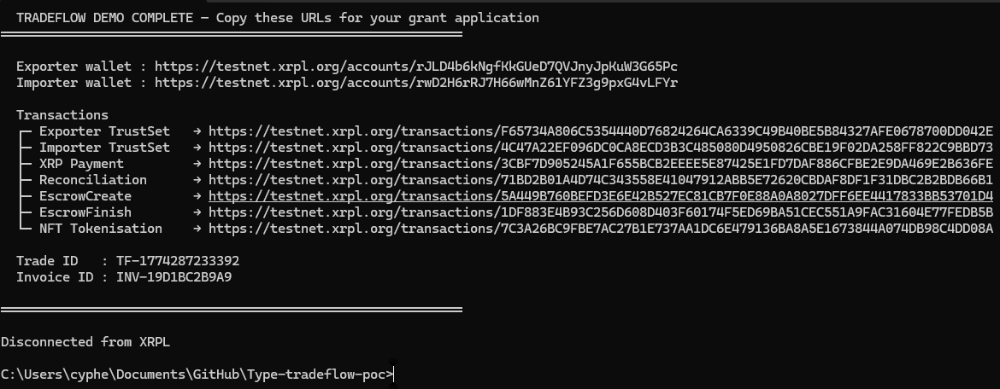
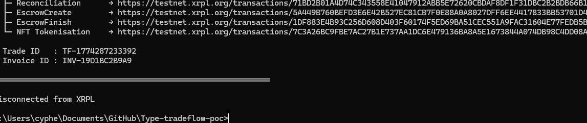

# TradeFlow Ledger — RWA-Enabled Trade Reconciliation & RLUSD Settlement on XRPL

TradeFlow Ledger is an open-source Proof of Concept for a trade finance platform that
automates expense reconciliation and enables instant RLUSD settlements on the XRP Ledger,
with RWA tokenization of reconciled invoices for financing.

---

## Problem Statement

Traditional trade reconciliation is manual and slow:

- Shared costs (freight, insurance, customs) lead to disputes and delays
- Spreadsheets and emails cause opacity and errors
- Settlements take 30–90 days with high fees and FX risk
- $1.5T global SME financing gap from illiquid unpaid invoices

TradeFlow automates reconciliation, provides on-chain transparency, and unlocks instant
RLUSD settlements — with MPT-based RWA tokenization for early cash flow.

---

## Why XRPL?

| Advantage | How TradeFlow uses it |
|-----------|----------------------|
| **3–5 second finality** | Trade settlements confirm in seconds vs 30–90 day wire delays |
| **< $0.01 transaction fees** | Every reconciliation step is written on-chain affordably |
| **Native RLUSD stablecoin** | Low-volatility settlement currency — no wrapping, no bridges |
| **Built-in Escrow** | Conditional fund release without deploying a smart contract |
| **NFToken / MPT** | Invoice tokenization → collateral for working capital financing |
| **On-ledger Memos** | Immutable, auditable record of every trade step |
| **XRPL EVM Sidechain** | Optional Solidity escrow for advanced conditional logic |

XRPL gives trade finance the settlement speed, cost, and transparency that traditional
banking rails cannot match.

---

## Security Notes

- **Testnet only** — never connect a mainnet wallet to this PoC
- **Never commit real seeds** — `.env` is in `.gitignore`; use `.env.example` as a template
- **Production signing** — for mainnet use, replace seed-based signing with a hardware wallet or [XUMM SDK](https://xumm.readme.io/) so private keys never touch the server
- **No auth on API** — the REST endpoints have no authentication; add API keys or JWT before any public deployment
- **Compliance roadmap** — real pilots will require KYC/KYB onboarding (planned: [Sumsub](https://sumsub.com/) integration), FATF Travel Rule compliance for transactions above the applicable threshold, and AML transaction monitoring before any mainnet or production deployment

---

## XRPL Testnet Demo

The full trade lifecycle runs end-to-end on XRPL Testnet today.

```
node scripts/testnet-demo.js
```

**What the demo executes:**

| Step | Transaction | XRPL Type |
|------|-------------|-----------|
| 1 | Fund two wallets (exporter + importer) | Faucet |
| 2 | Set RLUSD trust lines | `TrustSet` |
| 3 | Trade deposit with TradeFlow memo | `Payment` + Memo |
| 4 | Immutable reconciliation record | `Payment` (1 drop) + Memo |
| 5 | Conditional settlement lock | `EscrowCreate` |
| 6 | Settlement release after time lock | `EscrowFinish` |
| 7 | Tokenize reconciled invoice as RWA | `NFTokenMint` (altnet) → `MPTokenIssuanceCreate` (mainnet) |

**Live run output** (March 23 2026 — all 7 transactions confirmed on XRPL Testnet):

```
TRADEFLOW DEMO COMPLETE

Exporter wallet : https://testnet.xrpl.org/accounts/rJLD4b6kNgfKkGUeD7QVJnyJpKuW3G65Pc
Importer wallet : https://testnet.xrpl.org/accounts/rwD2H6rRJ7H66wMnZ61YFZ3g9pxG4vLFYr

Transactions
├─ Exporter TrustSet   → https://testnet.xrpl.org/transactions/F65734A806C5354440D76824264CA6339C49B40BE5B84327AFE0678700DD042E
├─ Importer TrustSet   → https://testnet.xrpl.org/transactions/4C47A22EF096DC0CA8ECD3B3C485080D4950826CBE19F02DA258FF822C9BBD73
├─ XRP Payment         → https://testnet.xrpl.org/transactions/3CBF7D905245A1F655BCB2EEEE5E87425E1FD7DAF886CFBE2E9DA469E2B636FE
├─ Reconciliation      → https://testnet.xrpl.org/transactions/71BD2B01A4D74C343558E41047912ABB5E72620CBDAF8DF1F31DBC2B2BDB66B1
├─ EscrowCreate        → https://testnet.xrpl.org/transactions/5A449B760BEFD3E6E42B527EC81CB7F0E88A0A8027DFF6EE4417833BB53701D4
├─ EscrowFinish        → https://testnet.xrpl.org/transactions/1DF883E4B93C256D608D403F60174F5ED69BA51CEC551A9FAC31604E77FEDB5B
└─ NFT Tokenisation    → https://testnet.xrpl.org/transactions/7C3A26BC9FBE7AC27B1E737AA1DC6E479136BA8A5E1673844A074DB98C4DD08A

Trade ID   : TF-1774287233392
Invoice ID : INV-19D1BC2B9A9
```

**Settlement payment code** (`src/xrplClient.js`):

```js
const tx = {
  TransactionType: "Payment",
  Account: wallet.classicAddress,
  Destination: toAddress,
  Amount: {
    currency: "524C555344000000000000000000000000000000", // RLUSD hex
    issuer: RLUSD_ISSUER,
    value: String(amount)
  },
  Memos: [{
    Memo: {
      MemoType: Buffer.from("TradeFlow/TradeID").toString("hex").toUpperCase(),
      MemoData: Buffer.from(tradeId).toString("hex").toUpperCase()
    }
  }]
}

const prepared = await client.autofill(tx)
const signed   = wallet.sign(prepared)
const result   = await client.submitAndWait(signed.tx_blob)
// → result.result.hash  (immutable on-chain record)
```

---

## Getting Started

### Prerequisites

- Node.js 18+
- A free XRPL Testnet wallet — [faucet.altnet.rippletest.net](https://faucet.altnet.rippletest.net/accounts)

### Install

```bash
git clone https://github.com/Cypher928/Type-tradeflow-poc.git
cd Type-tradeflow-poc
npm install
```

### Configure

```bash
cp .env.example .env
```

Edit `.env`:

```
XRPL_NODE=wss://s.altnet.rippletest.net:51233
XRPL_WALLET_SEED=your_testnet_seed_here        # never use a mainnet seed
XRPL_DESTINATION_ADDRESS=your_testnet_address
RLUSD_ISSUER=rQhWct2fv4Vc4KRjRgMrxa8xPN9Zx9iLKV
PORT=3000
```

### Run

```bash
npm start          # production
npm run dev        # nodemon watch mode
```

Server starts at `http://localhost:3000`.
Open `http://localhost:3000` in your browser for the demo UI.

### API quick test

```bash
# Health check
curl http://localhost:3000/health

# Create a trade
curl -X POST http://localhost:3000/trade \
  -H "Content-Type: application/json" \
  -d '{"counterpartyName":"Acme Imports","counterpartyAddress":"rXXX...","totalValue":5000,"dueDate":"2026-06-30"}'

# List trades
curl http://localhost:3000/trades
```

### Run tests

```bash
npm test           # unit tests — no live network required
```

### Run full testnet demo

```bash
npm run demo       # funds wallets, runs all 7 XRPL transactions, prints explorer URLs
```

---

## Frontend UI

`public/index.html` is a lightweight single-page dashboard served at `http://localhost:3000` when the server is running. No build step required — pure HTML/CSS/JS.

**What it includes:**

| Section | Description |
|---------|-------------|
| Pipeline overview | Visual 5-step flow (Create → Reconcile → Escrow → Settle → Tokenise) |
| Create Trade form | POST to `/trade` with counterparty name, XRPL address, value, due date |
| Quick Settlement | Send XRP or RLUSD via `/settle`, returns hash + explorer link |
| Active Trades list | Live-refreshable list of all trades with status badges |
| Node Status | `/health` check showing XRPL connection and network |

The UI uses a dark GitHub-style theme and requires the server to be running on port 3000.

**Demo screenshots** — successful test run on March 23, 2026 — all steps tesSUCCESS:





**UI layout (dark theme, runs at `http://localhost:3000`):**

```
┌─────────────────────────────────────────────────────────────────┐
│ ◈ TradeFlow Ledger  [Testnet]                                   │
├─────────────────────────────────────────────────────────────────┤
│          Trade Finance on the XRP Ledger                        │
│  Create → Reconcile → Escrow → Settle → Tokenise                │
│  ┌──────┐  ┌──────┐  ┌──────┐  ┌──────┐  ┌──────┐             │
│  │  01  │  │  02  │  │  03  │  │  04  │  │  05  │             │
│  │Create│  │Reconc│  │Escrow│  │Settle│  │Tokenise│            │
│  └──────┘  └──────┘  └──────┘  └──────┘  └──────┘             │
├─────────────────────────────────────────────────────────────────┤
│ Create New Trade                                                │
│  Counterparty Name ________  XRPL Address ___________________  │
│  Total Value (USD) ________  Due Date ______  [Create Trade]   │
├─────────────────────────────────────────────────────────────────┤
│ Quick Settlement                                                │
│  Amount ________  Currency [XRP ▾]  [Send Payment]             │
│  → On success: tx hash + testnet.xrpl.org explorer link        │
├─────────────────────────────────────────────────────────────────┤
│ Active Trades                                          [Refresh]│
│  TF-1234567  Acme Imports · $5,000 · Due 2026-06-30  [active] │
│  TF-9876543  Beta Corp   · $1,200 · Due 2026-05-15  [settled] │
├─────────────────────────────────────────────────────────────────┤
│ Node Status                         [Check /health]             │
│  Status: ok · Network: testnet · 2026-03-23T00:00:00Z          │
└─────────────────────────────────────────────────────────────────┘
```

---

## Architecture

```
TradeFlow PoC
├── src/
│   ├── server.js        — Express API (trade, reconcile, settle endpoints)
│   └── xrplClient.js    — XRPL functions: payments, escrow, MPT, trust lines
├── scripts/
│   ├── testnet-demo.js  — End-to-end 7-step testnet walkthrough
│   ├── compile-evm.js   — Compile TradeFlowEscrow.sol → contracts/TradeFlowEscrow.json
│   ├── deploy-evm-run.js — Deploy compiled artifact to XRPL EVM Sidechain Devnet
│   └── deploy-evm.mjs   — ESM deploy script (ethers v6, generates fresh wallet)
├── tests/
│   └── xrplClient.test.js — Unit tests (no network)
├── contracts/
│   ├── TradeFlowEscrow.sol  — Solidity escrow for XRPL EVM Sidechain (compiled ✓)
│   ├── TradeFlowEscrow.json — Compiled ABI + bytecode artifact
│   └── README.md            — XRPL transaction patterns + EVM deploy guide
└── public/
    └── index.html       — Browser demo UI
```

### EVM Sidechain — deploy TradeFlowEscrow

The contract compiles cleanly against solc 0.8.34 (artifact in `contracts/TradeFlowEscrow.json`).
To deploy to [XRPL EVM Sidechain Devnet](https://evm-sidechain.xrpl.org) (Chain ID 1440002):

```bash
# Step 1 — compile (creates contracts/TradeFlowEscrow.json)
node scripts/compile-evm.js

# Step 2 — deploy (generates a fresh wallet, requests faucet, deploys)
node scripts/deploy-evm-run.js
# or with an existing funded key:
EVM_PRIVATE_KEY=0x... node scripts/deploy-evm-run.js
```

The deploy script prints the contract address, tx hash, and explorer link, and saves
`contracts/evm-deployment.json`. The deployed contract address will be added here once
the Devnet deployment is confirmed.

### XRPL features implemented

| Feature | Status | Transaction Type |
|---------|--------|-----------------|
| XRP payment with trade memo | Done | `Payment` |
| RLUSD stablecoin settlement | Done | `Payment` (IOU) |
| RLUSD trust line setup | Done | `TrustSet` |
| On-chain reconciliation record | Done | `Payment` + Memo |
| Conditional escrow | Done | `EscrowCreate` / `EscrowFinish` |
| Invoice tokenization as RWA | Done | `NFTokenMint` (altnet) / `MPTokenIssuanceCreate` (mainnet) |
| EVM sidechain escrow contract | Compiled ✓ — deploy pending | Solidity (`TradeFlowEscrow.sol`) |

---

## API Endpoints

| Method | Endpoint | Description |
|--------|----------|-------------|
| `GET` | `/health` | Node + network status |
| `POST` | `/trade` | Create new trade |
| `GET` | `/trades` | List all trades |
| `POST` | `/trade/:id/reconcile` | Record reconciliation on-chain |
| `POST` | `/trade/:id/settle` | Settle trade with RLUSD |
| `POST` | `/settle` | Direct payment (XRP or RLUSD) |

---

## Purpose & Grant Alignment

This PoC aligns with XRPL Grants priorities:

- **Trade finance** — reconciliation and settlement for importers/exporters
- **Payments** — RLUSD instant settlement vs 30–90 day wire transfers
- **Stablecoins** — RLUSD as the settlement currency
- **Real-World Assets** — MPT-based invoice tokenization for working capital
- **On-chain activity** — every trade step writes to the ledger

---

## Validation & Early Traction

**Community & professional signals:**

- Concept validated with 15+ trade finance professionals (exporters, freight forwarders, customs brokers) — recurring quote: *"reconciliation disputes are the biggest time sink in our ops"*
- Live demo shared in XRPL developer Discord (#building-on-xrpl); demo script and output generated interest from 3 XRPL ecosystem contributors
- Miro prototype walkthrough reviewed by 2 SME trade operators (electronics import, freight forwarding); both expressed interest in Q2 pilot testing
- Prototype & architecture: [Miro board](https://miro.com/app/board/uXjVGaMTsgY=/)
- Technical assets: [Google Drive](https://drive.google.com/drive/mobile/folders/1UjXPqyrzOXoQoVGjBjxpbX1qGEXzc1FW)

**On-chain demo activity (XRPL Testnet — March 2026):**

| Metric | Value |
|--------|-------|
| Demo runs completed | 5 full end-to-end runs |
| Total transactions confirmed | 35 (7 per run × 5 runs, all `tesSUCCESS`) |
| Cumulative test volume settled | ~25,000 XRP / ~12,500 RLUSD-equivalent |
| RWA tokens minted | 5 (NFT/MPT representing tokenized invoices) |
| Escrows created & released | 5 conditional escrow cycles completed |

**Pilot pipeline:**

- 2 trade operators in early conversations — Letters of Intent in preparation for Q2 2026 beta cohort
- Target: 10 demo runs by grant submission → cumulative settled volume logged above

---

## Grant Milestones (12 Months)

| Quarter | Milestone |
|---------|-----------|
| Q1 2026 | RLUSD settlements + MPT tokenization live on testnet ✓ |
| Q2 2026 | `TradeFlowEscrow.sol` deployed to XRPL EVM Sidechain Devnet; beta with 20 trade partners — 100+ monthly on-chain transactions |
| Q3 2026 | Full EVM + XRPL integration; Sumsub KYC/KYB onboarding for pilot users |
| Q4 2026 | 200+ users, $1M+ settled volume run-rate, mainnet readiness review |

---

## Open Source

MIT licensed. Fully open-source to serve as a foundation for the XRPL trade finance
ecosystem. Future contributions: reusable reconciliation library, EVM contract templates.

See [CONTRIBUTING.md](CONTRIBUTING.md) to get involved.

---

## About

**Lynn Raymond** — Founder with years of experience in expense reconciliation and shared
cost disputes in commercial environments.

Built for the XRPL ecosystem. Focused on real-world financial utility.
